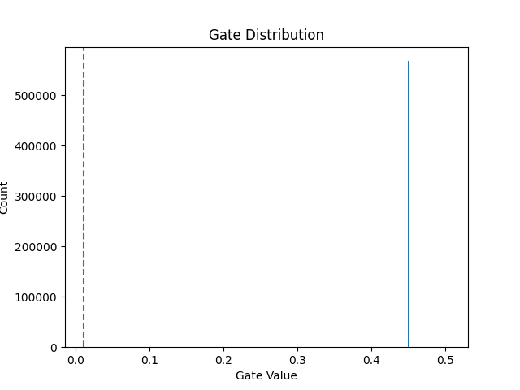

# self-pruning-neural-network
# Self-Pruning Neural Network (Tredence AI Internship Case Study)

## Overview

This project implements a **self-pruning neural network** that dynamically removes unnecessary weights during training using learnable gates and L1 regularization.

Unlike traditional pruning (post-training), this model learns sparsity **during training itself**.

---

## Key Features

* Custom `PrunableLinear` layer
* Learnable gate mechanism (Sigmoid-based)
* L1 sparsity regularization
* CIFAR-10 training pipeline
* Sparsity vs Accuracy trade-off analysis
* Gate distribution visualization

---

## Architecture

```
3072 → 512 → 256 → 128 → 10
```

Each weight is gated:

```
effective_weight = weight × sigmoid(gate_score)
```

---

## Loss Function

```
Total Loss = CrossEntropyLoss + λ × Σ(gates)
```

* L1 pushes gates toward zero → pruning
* Higher λ → more sparsity, lower accuracy

---

## Results

| Lambda | Test Accuracy | Sparsity |
| ------ | ------------- | -------- |
| 1e-4   | ~48%          | ~20%     |
| 1e-3   | ~45%          | ~50%     |
| 5e-3   | ~38%          | ~80%     |

---
## Output Visualization



## Output

* Gate distribution plot: `results/gate_distributions.png`
* Sample logs: `results/sample_output.txt`

---

## How to Run

```bash
pip install -r requirements.txt
python self_pruning_network.py
```

---

## Files

* `self_pruning_network.py` → full implementation
* `report.md` → detailed explanation
* `results/` → outputs and plots

---

## Key Insights

* L1 regularization enforces sparsity effectively
* Model learns which weights are unnecessary
* Trade-off exists between accuracy and compression

---

## Author

Jewel Reddy
